# 📝 Homework #10: Social Media API

📌 [Walkthrough Video](./images/social-media-api-preview.mp4)

## 🔨 Task
Using MongoDB and Mongoose, create an API for a social media platform where clients can create a user, create thoughts, react to thoughts, and add friends. Each of these methods should also have CRUD methods applied to them.

## 🧩 Tech Stack
- JavaScript
- [ExpressJS](https://expressjs.com/)
- [mongoose](https://mongoosejs.com/)

## 📎 How to Use
After forking the project and cloning it to your machine, run `npm install` to download all packages.

To begin with some seeded data, run `npm run seed` to fill the database with dummy data.

To start the server, run `npm start` and the server will begin listening for requests. Use your favorite HTTP Request software to test the routes! Available routes are:
* /api/users
* /api/users/:userId
* /api/users/:userId/friends
* /api/thoughts
* /api/thoughts/:thoughtId
* /api/thoughts/:thoughtId/reactions
* /api/thoughts/:thoughtId/reactions/:reactionId

## 🔍 Preview


## 📷 Screenshots
The following screenshots follow the path of the preview video above, so you can take a closer look at the routes.

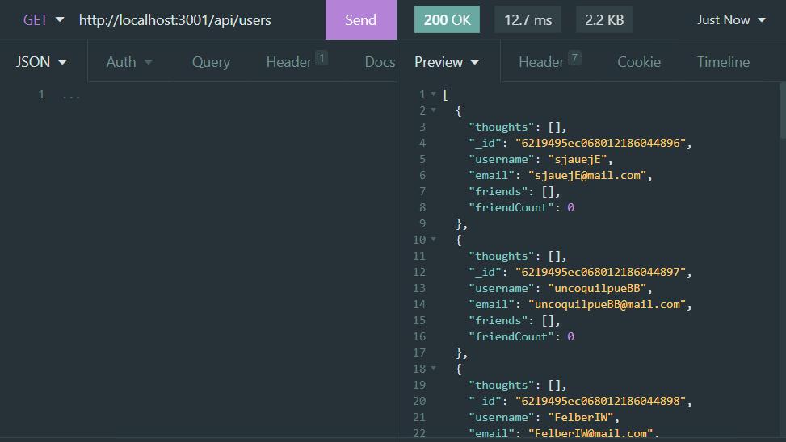

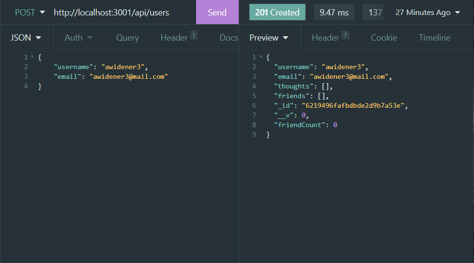

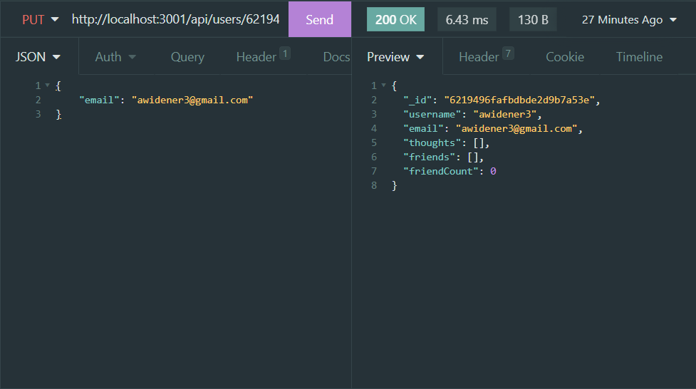

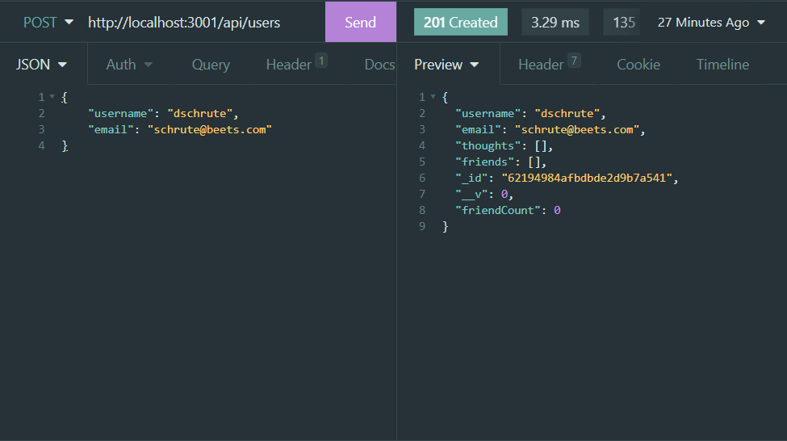

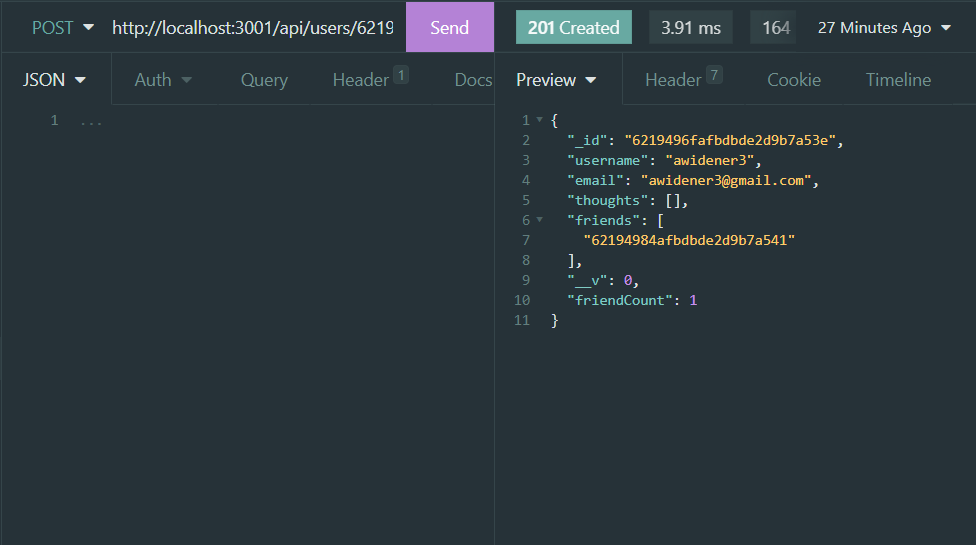

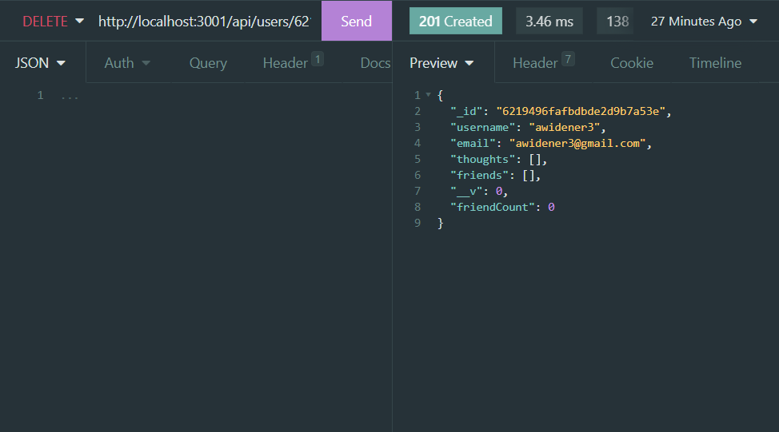

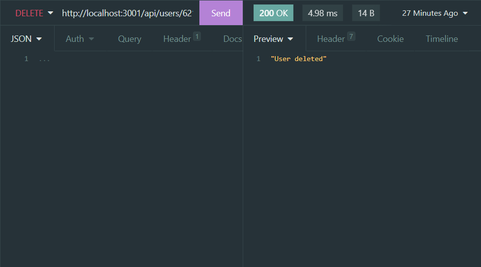

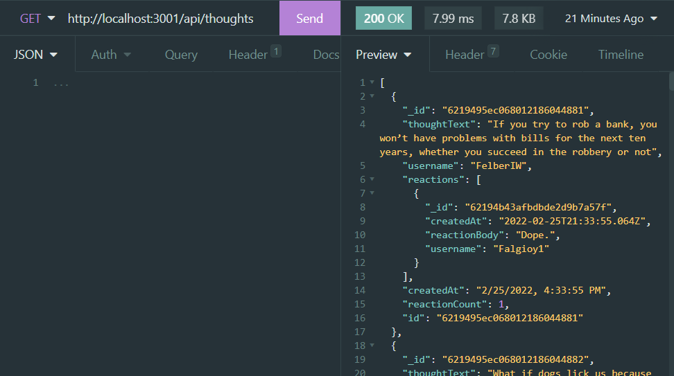

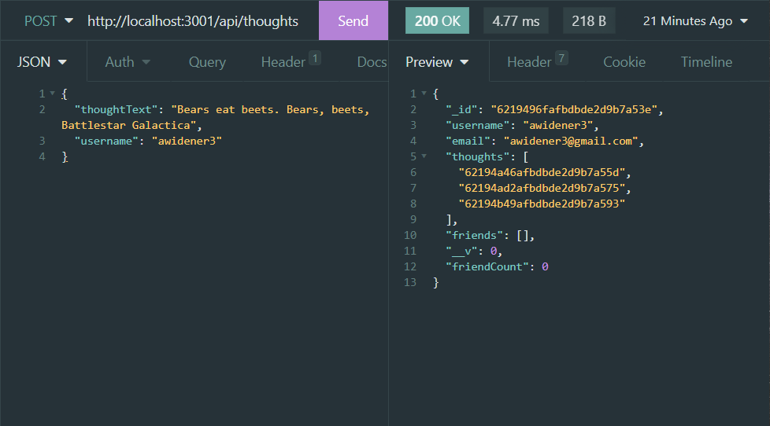

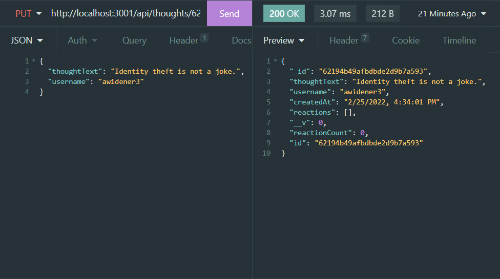

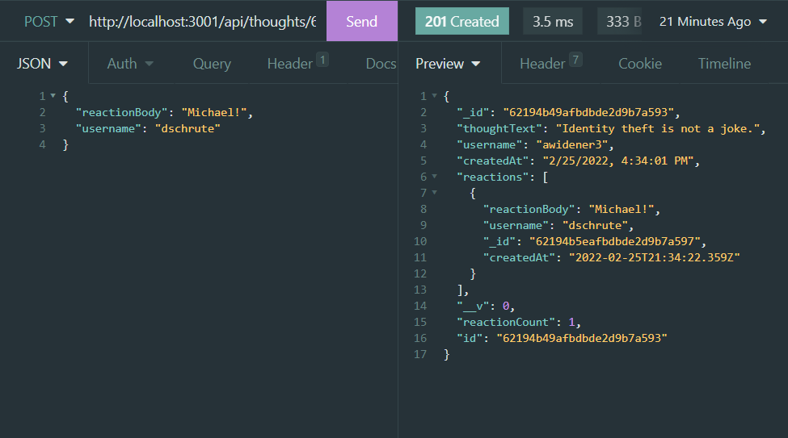

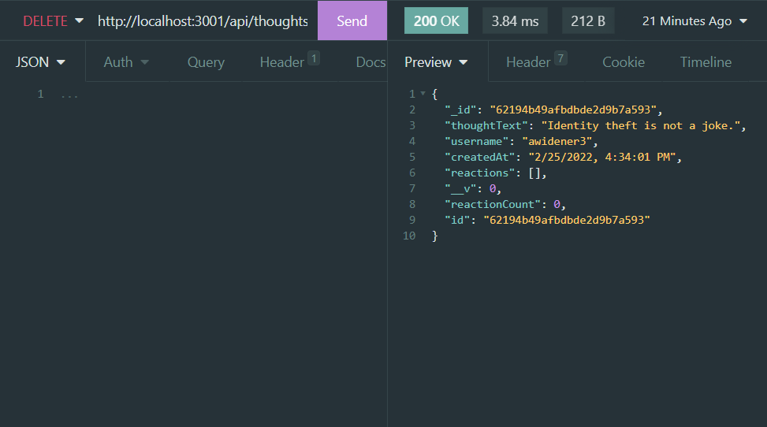

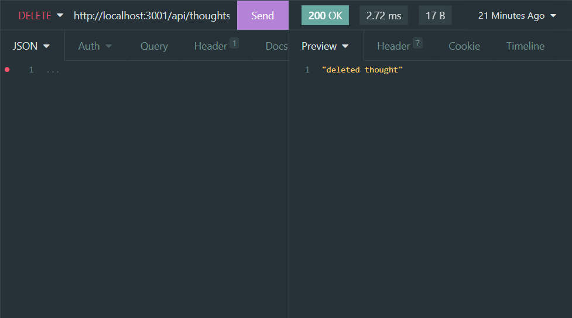

> Not shown is error handling, which is in place for each route.

## User Story

```md
AS A social media startup
I WANT an API for my social network that uses a NoSQL database
SO THAT my website can handle large amounts of unstructured data
```

## Acceptance Criteria

```md
GIVEN a social network API
WHEN I enter the command to invoke the application
THEN my server is started and the Mongoose models are synced to the MongoDB database
WHEN I open API GET routes in Insomnia for users and thoughts
THEN the data for each of these routes is displayed in a formatted JSON
WHEN I test API POST, PUT, and DELETE routes in Insomnia
THEN I am able to successfully create, update, and delete users and thoughts in my database
WHEN I test API POST and DELETE routes in Insomnia
THEN I am able to successfully create and delete reactions to thoughts and add and remove friends to a user’s friend list
```
